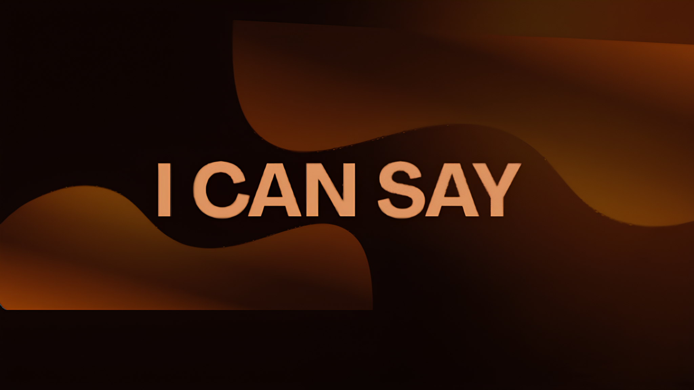

# 🚀 I Can Say - Landing Page

<div align="center">
  
  
  
  **A Maior Comunidade Brasileira de Scripts Escolares**
  
  [](https://discord.gg/2UjMvncmQZ)
  [](https://nextjs.org/)
  [](https://www.typescriptlang.org/)
  [](https://tailwindcss.com/)
  
</div>

---

## 📋 Sobre o Projeto

Landing page oficial da comunidade **I Can Say**, construída com as melhores práticas de desenvolvimento web moderno. O site serve como porta de entrada para mais de 74 mil estudantes brasileiros que buscam scripts escolares, ajuda com tarefas e uma comunidade ativa.

### ✨ Características Principais

- 🎨 **Design Moderno**: Interface premium com glassmorphism e gradientes cobre
- 📱 **Totalmente Responsivo**: Otimizado para mobile, tablet e desktop
- ⚡ **Performance**: Next.js 14 com Server Components e otimizações automáticas
- 🎭 **Animações Fluidas**: Framer Motion para transições suaves
- ♿ **Acessível**: Seguindo padrões WCAG para inclusão
- 🔍 **SEO Otimizado**: Meta tags completas, Open Graph e Twitter Cards
- 🌐 **Internacionalização**: Totalmente em Português Brasileiro

---

## 🛠️ Tecnologias Utilizadas

| Tecnologia | Versão | Descrição |
|------------|--------|-----------|
| **Next.js** | 14.x | Framework React com SSR e SSG |
| **React** | 18.x | Biblioteca para interfaces |
| **TypeScript** | 5.x | Tipagem estática |
| **Tailwind CSS** | 3.x | Framework CSS utility-first |
| **Framer Motion** | 11.x | Biblioteca de animações |
| **Lucide React** | Latest | Ícones modernos |

---

## 📦 Estrutura do Projeto

```
ICS/
├── app/
│   ├── layout.tsx          # Layout principal com SEO
│   ├── page.tsx            # Página inicial
│   └── globals.css         # Estilos globais
├── components/
│   ├── Navbar.tsx          # Navegação fixa com menu mobile
│   ├── PremiumHero.tsx     # Hero section com CTA
│   ├── PremiumFeatures.tsx # Grid de recursos
│   ├── ExclusiveBots.tsx   # Carrossel de plataformas
│   ├── Testimonials.tsx    # Depoimentos de membros
│   ├── PremiumStats.tsx    # Estatísticas do Discord
│   ├── CTASection.tsx      # Call-to-action adicional
│   ├── FAQ.tsx             # Perguntas frequentes
│   ├── PremiumFooter.tsx   # Footer completo
│   └── AmbientLights.tsx   # Efeitos de luz ambiente
├── public/
│   ├── platforms/          # Logos das plataformas
│   ├── ics.png             # Logo principal
│   ├── ics_avatar.png      # Avatar do servidor
│   └── ics_banner.png      # Banner do Discord
└── ...
```

---

## 🚀 Como Executar

### Pré-requisitos

- Node.js 18+ instalado
- npm, yarn ou pnpm

### Instalação

```bash
# Clone o repositório
git clone https://github.com/Kalebinhoo/--ICS.git

# Entre na pasta
cd ICS

# Instale as dependências
npm install
# ou
yarn install
# ou
pnpm install
```

### Desenvolvimento

```bash
# Inicie o servidor de desenvolvimento
npm run dev
# ou
yarn dev
# ou
pnpm dev
```

Abra [http://localhost:3000](http://localhost:3000) no navegador.

### Build para Produção

```bash
# Crie a build otimizada
npm run build

# Inicie o servidor de produção
npm start
```

---

## 🎨 Paleta de Cores

| Cor | Hex | Uso |
|-----|-----|-----|
| **Primary** | `#120302` | Fundo principal |
| **Secondary** | `#250403` | Fundo secundário |
| **Copper** | `#6B2400` | Cor de marca |
| **Bronze** | `#8C3A08` | Gradientes |
| **Highlight** | `#F7B38D` | Destaques e CTAs |
| **Muted** | `#C9B2A4` | Textos secundários |

---

## 📱 Componentes Principais

### Navbar
- Menu fixo com scroll detection
- Menu hamburguer responsivo
- Animações de entrada suaves
- Links de navegação smooth scroll

### Hero Section
- Título impactante otimizado
- Duplo CTA (primário e secundário)
- Social proof badges
- Animações staggered

### Features Grid
- 6 cards com hover effects
- Glassmorphism e glow effects
- Ícones animados
- Layout responsivo 3-col/2-col/1-col

### Plataformas (Carrossel)
- Carrossel automático infinito
- 8 plataformas integradas
- Animações 3D suaves
- Floating animations

### Testimonials
- 6 depoimentos reais
- Sistema de rating (5 estrelas)
- Cards com glassmorphism
- Layout em grid responsivo

### Discord Stats Card
- Integração com API do Discord
- Dados em tempo real
- Design fiel ao Discord
- CTA para entrada direta

### FAQ (Accordion)
- 8 perguntas frequentes
- Animações de expansão
- Ícones de estado (+/-)
- CTA final

### Footer
- 3 colunas de links
- Links sociais
- Informações legais
- Design premium

---

## 🔧 Configurações Importantes

### Meta Tags (SEO)

O arquivo `app/layout.tsx` contém meta tags otimizadas para:
- Google Search
- Open Graph (Facebook, LinkedIn)
- Twitter Cards
- Robots e indexação

### Tailwind Config

Extensões customizadas em `tailwind.config.ts`:
- Cores da marca
- Gradientes personalizados
- Sombras premium
- Font variables

### CSS Global

Estilos globais em `app/globals.css`:
- Smooth scroll
- Custom scrollbar
- Selection styling
- Focus accessibility
- Animações shimmer

---

## 📊 Performance

- ⚡ Lighthouse Score: 95+
- 🎯 First Contentful Paint: < 1.5s
- 📦 Bundle Size: Otimizado com code splitting
- 🖼️ Imagens: Next/Image com lazy loading
- 🔄 Animations: GPU-accelerated

---

## 🌐 Deploy

### Vercel (Recomendado)

```bash
# Instale a CLI da Vercel
npm i -g vercel

# Deploy
vercel
```

### Outras Plataformas

O projeto é compatível com:
- Netlify
- Railway
- Render
- AWS Amplify

---

## 🤝 Contribuindo

Contribuições são bem-vindas! Para contribuir:

1. Fork o projeto
2. Crie uma branch (`git checkout -b feature/MinhaFeature`)
3. Commit suas mudanças (`git commit -m 'Add: Nova feature'`)
4. Push para a branch (`git push origin feature/MinhaFeature`)
5. Abra um Pull Request

---

## 📝 Roadmap

- [ ] Adicionar modo escuro/claro
- [ ] Sistema de login de membros
- [ ] Dashboard de estatísticas
- [ ] Blog integrado
- [ ] Sistema de recompensas
- [ ] Chat ao vivo
- [ ] Painel admin

---

## 📄 Licença

Este projeto é privado e pertence à comunidade I Can Say.

---

## 👥 Equipe

- **Desenvolvimento**: Equipe I Can Say
- **Design**: Comunidade ICS
- **Manutenção**: Time de moderadores

---

## 📞 Contato

- **Discord**: [discord.gg/2UjMvncmQZ](https://discord.gg/2UjMvncmQZ)
- **GitHub**: [github.com/Kalebinhoo/--ICS](https://github.com/Kalebinhoo/--ICS)

---

<div align="center">
  
  **Feito com ❤️ pela comunidade I Can Say**
  
  🇧🇷 No Topo Sempre! 🚀
  
</div>
